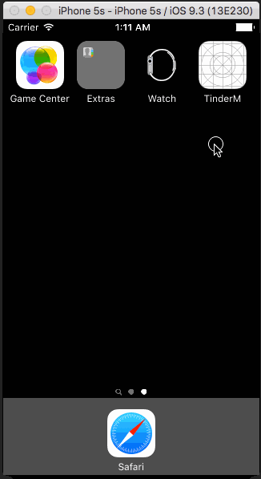

# Project 5 - *Tinder :heart:*

**Tinder :heart:** is an iOS app that is a clone of the Tinder app.

Time spent: **5** hours spent in total

## User Stories

The following features are implemented:
  
- [x] :blue_heart: Pan Gesture Recognizers :yellow_heart:
- [x] :purple_heart: Custom Views :heartpulse:
- [x] :cupid: Affine Transform & Rotation :green_heart:

## Video Walkthrough 

GIF created with [LiceCap](http://www.cockos.com/licecap/).

## Notes

So much :heart::heart::heart::heart::heart::heart::heart::heart::heart::heart::heart::heart:

## License

Copyright [2016] [Monte Thakkar]

Licensed under the Apache License, Version 2.0 (the "License");
you may not use this file except in compliance with the License.
You may obtain a copy of the License at

http://www.apache.org/licenses/LICENSE-2.0

Unless required by applicable law or agreed to in writing, software
distributed under the License is distributed on an "AS IS" BASIS,
WITHOUT WARRANTIES OR CONDITIONS OF ANY KIND, either express or implied.
See the License for the specific language governing permissions and
limitations under the License.

